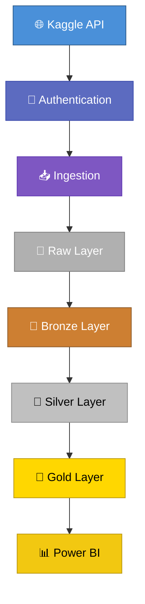

# 🏦 Credit Score Data Platform

> End-to-end Data Engineering platform for credit risk analytics using Medallion Architecture, data quality, governance practices and analytics-ready datasets.


---

# 📌 Project Status

🚧 **Under development**

**Overall progress:** `████████████████░░░░░░░░░░░░░░` **44%** (4/9)

| Stage | Progress | Status |
| --- | --- | --- |
| Project bootstrap | `██████████` 100% | ✅ |
| Data ingestion | `██████████` 100% | ✅ |
| Bronze layer | `██████████` 100% | ✅ |
| Silver layer | `██████████` 100% | ✅ |
| Gold layer | `░░░░░░░░░░` 0% | ⏳ |
| Docker | `░░░░░░░░░░` 0% | ⏳ |
| Airflow | `░░░░░░░░░░` 0% | ⏳ |
| Power BI | `░░░░░░░░░░` 0% | ⏳ |

---

# 📖 Overview

This project simulates a production-grade Data Engineering platform built for the fictional fintech **Data Girls Finance**.

Using the Kaggle **Credit Score Classification** dataset, the platform ingests, validates, transforms and prepares credit data for analytics following modern Data Engineering best practices.

The solution is designed to be:

- 🏗️ Based on Medallion Architecture
- ✅ Quality-driven
- 🛡️ LGPD-aware
- 📊 Analytics-ready
- ⚙️ Fully automated
- 💻 Local-first and free to execute

---

# ✨ Features

- ✅ Automated dataset ingestion through the Kaggle API
- ✅ Automatic Kaggle credential discovery (Windows, Linux, macOS and WSL)
- ✅ Reproducible local execution
- ✅ Medallion Architecture (Raw → Bronze → Silver → Gold)
- ✅ Parquet-based storage
- ✅ Schema-driven validation
- ✅ Data quality checks
- ✅ LGPD-aware transformations
- ✅ Unit tested pipeline
- 🚧 Gold analytics layer
- 🚧 Apache Airflow orchestration
- 🚧 Docker deployment
- 🚧 Power BI dashboard

---

# 🧰 Tech Stack

## Current

- Python
- Pandas
- PyArrow
- Parquet
- Kaggle API
- Pytest
- Power BI Desktop

## Planned

- Docker
- Apache Airflow
- Ruff
- Black
- Pre-commit

---

# 🏗️ Architecture



## Layer Responsibilities

| Layer | Responsibility |
| --- | --- |
| Raw | Stores the original files downloaded from the Kaggle API. |
| Bronze | Preserves immutable raw data in Parquet format. |
| Silver | Produces trusted, validated and standardized datasets. |
| Gold | Produces analytics-ready dimensional models and business metrics. |

---

# 📂 Project Structure

```text
credit-score-data-platform/
├── data/
│   ├── raw/
│   ├── bronze/
│   ├── silver/
│   ├── gold/
│   └── reports/
├── dashboard/
├── dags/
├── docs/
├── notebooks/
├── src/
│   ├── config/
│   ├── ingestion/
│   ├── observability/
│   ├── processing/
│   │   ├── bronze/
│   │   ├── silver/
│   │   └── gold/
│   ├── storage/
│   └── utils/
└── tests/
    ├── integration/
    └── unit/
```

---

# 📋 Prerequisites

- Python 3.12+
- Git
- Kaggle account
- Kaggle API credentials

---

# 🚀 Quick Start

## Clone the repository

```bash
git clone https://github.com/<your-user>/credit-score-data-platform.git

cd credit-score-data-platform
```

## Create a virtual environment

### Linux / macOS

```bash
python -m venv .venv

source .venv/bin/activate
```

### Windows

```powershell
python -m venv .venv

.venv\Scripts\activate
```

## Install dependencies

```bash
pip install -r requirements.txt
```

---

# 🔐 Kaggle API Authentication

The ingestion pipeline downloads the dataset directly from the official **Kaggle API**.

Manual downloads are **not required**.

A free Kaggle account is required.

## Generate your API credentials

1. Sign in to Kaggle.
2. Open **Account Settings**.
3. Under **API**, click **Create New Token**.
4. Kaggle will download a file named:

```text
kaggle.json
```

> Never commit this file to the repository.

---

## Linux / macOS

Move the credential file to:

```text
~/.kaggle/kaggle.json
```

Set secure permissions:

```bash
chmod 600 ~/.kaggle/kaggle.json
```

---

## Windows

Place the downloaded file at:

```text
C:\Users\<your-user>\.kaggle\kaggle.json
```

---

## Windows Subsystem for Linux (WSL)

This project automatically supports WSL.

When the ingestion pipeline runs:

1. It checks for credentials at:

```text
~/.kaggle/kaggle.json
```

2. If none are found, it automatically searches Windows user profiles for:

```text
C:\Users\<your-user>\.kaggle\kaggle.json
```

3. When exactly one valid credential file is found, it is securely copied into the WSL environment with restricted permissions.

No manual copy is required.

---

# 🚀 Reproducible Pipeline

After configuring Kaggle credentials, execute the entire pipeline locally.

## Download the source dataset

```bash
python -m src.ingestion.downloader
```

Downloads the dataset directly from the Kaggle API into the Raw layer.

---

## Build the Bronze Layer

```bash
python -m src.processing.bronze.bronze_loader
```

Creates immutable Bronze Parquet files while preserving every value exactly as received.

---

## Build the Silver Layer

```bash
python -m src.processing.silver.silver_loader
```

Builds trusted datasets by applying:

- Column standardization
- Invalid value replacement
- Numeric cleaning
- LGPD-aware handling
- Type conversion
- Schema validation
- Business rule validation

---

## Run automated tests

```bash
pytest
```

---

# 🔄 Data Flow

| Stage | Input | Output |
| --- | --- | --- |
| Ingestion | Kaggle API | Raw CSV |
| Bronze | Raw CSV | Bronze Parquet |
| Silver | Bronze Parquet | Trusted Parquet |
| Gold | Silver Parquet | Analytics Tables |

---

# 🛡️ Data Quality

The Silver layer automatically validates data before promoting it to the trusted zone.

Current validations include:

- ✅ Required columns
- ✅ Optional columns
- ✅ Data types
- ✅ Missing values
- ✅ Numeric ranges
- ✅ Allowed categorical values
- ✅ Invalid value replacement
- ✅ Schema enforcement
- ✅ LGPD-aware PII removal

---

# ✅ Tests

Run the automated test suite:

```bash
pytest
```

Current coverage includes:

- Bronze loader
- Silver cleaning
- Silver typing
- Silver validation

**Current status**

✅ 30 passing tests

---

# 🧠 Key Architecture Decisions

## Bronze Layer

The Bronze layer preserves the original dataset exactly as received.

It intentionally does **not**:

- ❌ Clean data
- ❌ Convert data types
- ❌ Validate business rules
- ❌ Remove sensitive information

---

## Silver Layer

The Silver layer represents the trusted data zone.

Responsibilities include:

- 🧹 Data cleaning
- 🛡️ LGPD-aware transformations
- 🔢 Type conversion
- 📐 Schema validation
- ✅ Business rule validation
- 🥇 Preparing data for Gold

---

## Schema-Driven Validation

The Silver layer uses a declarative schema as the single source of truth for:

- Expected columns
- Required columns
- Optional columns
- Data types
- Nullable rules
- Allowed values
- Numeric ranges

---

# 🗺️ Roadmap

`████████████████░░░░░░░░░░░░░░` **4/9 completed**

- [x] Project bootstrap
- [x] Data ingestion
- [x] Bronze layer
- [x] Silver layer
- [ ] Gold layer
- [ ] Docker
- [ ] Airflow
- [ ] Power BI
- [ ] Final documentation

---

# 🚀 Future Improvements

- Docker Compose
- Apache Airflow scheduling
- CI/CD pipeline
- Data lineage
- Data catalog
- Great Expectations integration
- dbt models
- Cloud deployment
