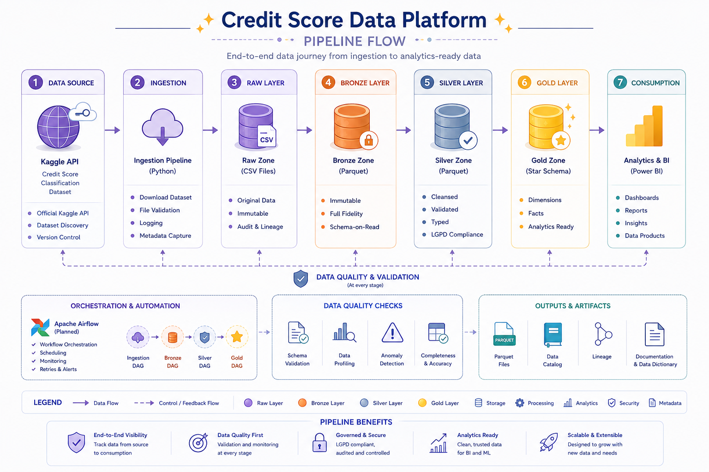
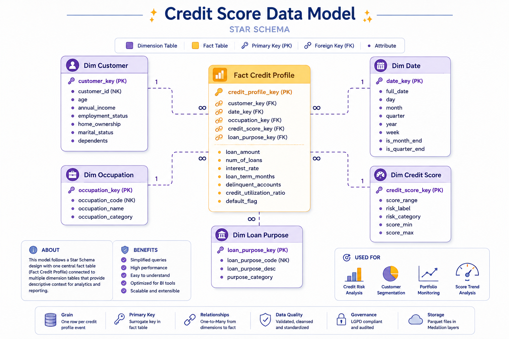

<a id="top"></a>

# 🏦 Credit Score Data Platform

<p align="center">
  
</p>

<p align="center">
  
  
  
  

</p>

---

## 📖 Overview

This project implements an **end-to-end Data Engineering Platform** based on the **Medallion Architecture**, using the **Credit Score Classification** dataset from Kaggle.

The objective is to simulate a real production-grade data platform capable of:

- 📥 Ingesting raw data
- 🧹 Cleaning and validating datasets
- 🏗 Structuring analytical layers
- 📊 Delivering business-ready datasets
- ✅ Ensuring data quality
- 📈 Producing trusted data for analytics and Machine Learning

Rather than focusing only on ETL scripts, this repository follows engineering best practices commonly adopted in modern Data Platform teams.

<p align="right">
<a href="#top">back to top ⬆️</a>
</p>

## 📑 Table of Contents

- [✨ Highlights](#highlights)
- [🏗 Architecture](#architecture)
- [🧩 Data Model](#data-model)
- [🚀 Project Progress](#project-progress)
- [📂 Project Structure](#project-structure)
- [⚙️ Tech Stack](#tech-stack)
- [🚀 Getting Started](#getting-started)
- [📥 Data Ingestion](#data-ingestion)
- [▶ Running the Pipeline](#running-the-pipeline)
- [✅ Running Tests](#running-tests)
- [📚 Documentation](#documentation)
- [💡 Why This Project?](#why-this-project)
- [🚀 Future Improvements](#future-improvements)
- [🤝 Contributing](#contributing)
- [📄 License](#license)
- [🛸 About the Author](#about-the-author)

<p align="right">
<a href="#top">back to top ⬆️</a>
</p>

# ✨ Highlights

- Medallion Architecture (Bronze / Silver / Gold)
- Data Quality Validation
- Data Governance principles
- Privacy-aware processing aligned with the Brazilian General Data Protection Law (LGPD)
- Modular Python architecture
- Unit and Integration Tests with Pytest
- Docker-ready
- Analytics-ready datasets
- Professional project documentation
- Designed with scalability in mind

<p align="right">
<a href="#top">back to top ⬆️</a>
</p>

# 🏗 Architecture

<p align="center">
  
</p>

### Medallion Layers

| Layer | Description |
| ------- | ------------- |
| 🥉 Bronze | Raw immutable ingestion |
| 🥈 Silver | Cleaned, standardized and validated datasets |
| 🥇 Gold | Analytics-ready datasets optimized for business consumption |

<p align="right">
<a href="#top">back to top ⬆️</a>
</p>

# 🧩 Data Model

<p align="center">
  
</p>

<p align="right">
<a href="#top">back to top ⬆️</a>
</p>

# 🚀 Project Progress

**Overall Progress**

`████████░░░░░░` **72%**

| Stage | Progress |
| -------- | -------- |
| Project Bootstrap | ██████████ 100% |
| Data Ingestion | ██████████ 100% |
| Bronze Layer | ██████████ 100% |
| Silver Layer | ██████████ 100% |
| Gold Layer | ██████████ 100% |
| Integration Tests | ██████████ 100% |
| Docker | ░░░░░░░░░░ 0% |
| CI/CD | ░░░░░░░░░░ 0% |
| Documentation | ██████░░░░ 60% |

<p align="right">
<a href="#top">back to top ⬆️</a>
</p>

# 📂 Project Structure

```text
credit-score-data-platform/
│
├── .github/
│   ├── workflows/
│   ├── ISSUE_TEMPLATE/
│   └── PULL_REQUEST_TEMPLATE.md
│
├── dags/
│
├── dashboard/
│
├── data/
│   ├── raw/
│   ├── bronze/
│   ├── silver/
│   ├── gold/
│   └── reports/
│
├── docs/
│   ├── architecture/
│   ├── adr/
│   ├── governance/
│   └── images/
│
├── notebooks/
│
├── src/
│   ├── config/
│   ├── ingestion/
│   ├── observability/
│   ├── processing/
│   │   ├── bronze/
│   │   ├── silver/
│   │   └── gold/
│   └── utils/
│
├── tests/
│   ├── unit/
│   │   ├── bronze/
│   │   ├── silver/
│   │   └── gold/
│   └── integration/
│
├── .env.example
├── .gitignore
├── CONTRIBUTING.md
├── LICENSE
├── pyproject.toml
├── README.md
├── requirements.txt
└── requirements-dev.txt
```

<p align="right">
<a href="#top">back to top ⬆️</a>
</p>

# ⚙️ Tech Stack

- 🐍 **Python 3.12** — Core programming language
- 🐼 **Pandas** — Data manipulation and transformation
- 🪶 **PyArrow** — Parquet serialization and storage
- 🧪 **Pytest** — Unit and integration testing
- 📥 **Kaggle API** — Dataset ingestion
- 📝 **Python Logging** — Logging and observability
- 🗂️ **Parquet** — Columnar storage format
- 🌿 **Git & GitHub** — Version control and collaboration
- 🏗️ **Medallion Architecture** — Data platform architecture pattern

<p align="right">
<a href="#top">back to top ⬆️</a>
</p>

# 🚀 Getting Started

## Clone the repository

```bash
git clone git@github.com:femoli/credit-score-data-platform.git

cd credit-score-data-platform
```

## Create virtual environment

### Linux / macOS

```bash
python -m venv .venv
source .venv/bin/activate
```

### Windows

```powershell
python -m venv .venv
.venv\Scripts\activate
```

## Install dependencies

```bash
pip install -r requirements.txt
```

<p align="right">
<a href="#top">back to top ⬆️</a>
</p>

# 📥 Data Ingestion

This project automatically downloads the **Credit Score Classification** dataset from Kaggle using the Kaggle API.

## Prerequisites

Before running the ingestion pipeline, you must configure your Kaggle API credentials.

1. Create a Kaggle account.
2. Generate your API token (`kaggle.json`).
3. Place the file in the default Kaggle directory.

### Linux / macOS

```text
~/.kaggle/kaggle.json
```

### Windows

```text
C:\Users\<username>\.kaggle\kaggle.json
```

For more information, see the official Kaggle [API documentation](https://www.kaggle.com/docs/api).

To learn more about the source data, visit the [Credit Score Classification dataset](https://www.kaggle.com/datasets/parisrohan/credit-score-classification).

<p align="right">
<a href="#top">back to top ⬆️</a>
</p>

# ▶ Running the Pipeline

## 1. Download the dataset

```bash
python -m src.ingestion.ingest_dataset
```

## 2. Build the Bronze Layer

```bash
python -m src.processing.bronze.bronze_loader
```

## 3. Build the Silver Layer

```bash
python -m src.processing.silver.silver_loader
```

## 4. Build the Gold Layer

```bash
python -m src.processing.gold.gold_loader
```

<p align="right">
<a href="#top">back to top ⬆️</a>
</p>

# ✅ Running Tests

The project includes unit and integration tests implemented with Pytest.

## Testing Strategy

| Test Type         | Purpose                                                                            |
| ----------------- | ---------------------------------------------------------------------------------- |
| Unit Tests        | Validate individual functions, transformations and data quality rules in isolation |
| Integration Tests | Validate the complete Medallion pipeline from Raw ingestion to Gold datasets       |

## Run all tests

```bash
pytest
```

## Run unit tests

```bash
pytest tests/unit -v
```

## Run integration tests

```bash
pytest tests/integration -v
```

## Run tests without integration tests

```bash
pytest -m "not integration" -v
```

The integration test executes the complete local data pipeline:

```text
Raw CSV → Bronze Parquet → Silver Parquet → Gold Datasets
```

The Kaggle dataset must be available in `data/raw/` before running the integration test.

When the required raw files are unavailable, the integration test is skipped automatically.

Example output:

```text
=================================
52 passed
=================================
```

<p align="right">
<a href="#top">back to top ⬆️</a>
</p>


# 📚 Documentation

Detailed technical documentation is currently being prepared and will be available in the `docs/` directory in future iterations of the project.

<p align="right">
<a href="#top">back to top ⬆️</a>
</p>

# 💡 Why This Project?

This project was developed as the final assignment for the **(RE)Start Data Engineering Bootcamp**, organized by **Data Girls**.

Although originally developed as part of the bootcamp, the project was intentionally expanded following real-world engineering practices to become a production-inspired portfolio project.

The main objective is to demonstrate practical knowledge in:

- Data Platform Engineering
- Data Quality
- Data Governance
- Cloud Data Engineering
- Python
- Testing
- Documentation
- Project Organization
- Engineering Best Practices

### 💜 About @DataGirls

Data Girls is a non-profit community dedicated to empowering women through education, mentorship, networking, and collaboration.

This bootcamp is a **100% volunteer-driven initiative** created to promote **accessibility, representation, and technical growth**, helping participants build the skills and confidence needed to start and advance their careers in Data.

You can learn more about this incredible initiative [here](https://linktr.ee/DataGirls).

<p align="right">
<a href="#top">back to top ⬆️</a>
</p>

# 🚀 Future Improvements

| Feature | Status |
| ----------| ------ |
| ⚙️ CI/CD with GitHub Actions | 🚧 In Progress |
| 🐳 Docker containerization | 🚧 In Progress |
| ☁️ AWS-native deployment | 🔍 Research |
| 🌬️ Apache Airflow orchestration | 🔍 Research |
| 📈 Monitoring & observability | 📝 Planned |
| 📊 Business Intelligence dashboard | 📝 Planned |
| ♿ Accessibility improvements | 📝 Planned |
| 📚 Data catalog & metadata | 📝 Planned |
| 🔍 Data lineage | 📝 Planned |
| ✅ Automated data quality reports | 📝 Planned |

<p align="right">
<a href="#top">back to top ⬆️</a>
</p>

# 🤝 Contributing

Contributions, suggestions, and improvements are welcome.

Feel free to open an Issue or submit a Pull Request.

<p align="right">
<a href="#top">back to top ⬆️</a>
</p>

# 📄 License

This project is licensed under the MIT License.

See the **LICENSE** file for more information.

<p align="right">
<a href="#top">back to top ⬆️</a>
</p>

# 🛸 About the Author

<p>
<i>
I kinda like messy datasets and clean pipelines.<br>
Big data, ETL, and cloud migrations by day — probably overthinking a JOIN by night.
</i>
</p>

<p>
  <a href="https://github.com/femoli">
    
  </a>
</p>

<p>
Made with 🖤 and lots of 🍵 by <strong>Fernanda Oliveira</strong>
</p>

<p align="right">
<a href="#top">back to top ⬆️</a>
</p>