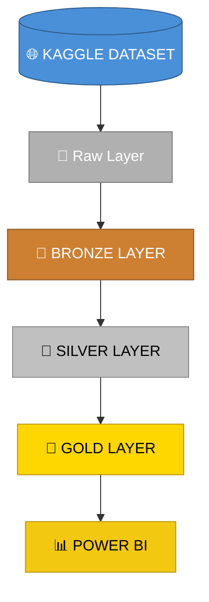

# 🏦 Credit Score Data Platform

> End-to-end Data Engineering platform for credit risk analytics using Medallion Architecture, data quality, governance practices and analytics-ready datasets.


---

## 📌 Project Status

🚧 **Under development**

**Overall progress:** `████████████████░░░░░░░░░░░░░░` **44%** (4/9)

| Stage | Progress | Status |
| --- | --- | --- |
| Project bootstrap | `██████████` 100% | ✅ |
| Data ingestion | `██████████` 100% | ✅ |
| Bronze layer | `██████████` 100% | ✅ |
| Silver layer | `██████████` 100% | ✅ |
| Gold layer | `░░░░░░░░░░` 0% | ⏳ |
| Docker | `░░░░░░░░░░` 0% | ⏳ |
| Airflow | `░░░░░░░░░░` 0% | ⏳ |
| Power BI | `░░░░░░░░░░` 0% | ⏳ |

---

## 📖 Overview

This project builds a data platform for the fictional fintech **Data Girls Finance**, using the Kaggle Credit Score Classification dataset.

The platform follows:

- 🏗️ Medallion Architecture
- ✅ Data Quality practices
- 🛡️ Data Governance principles
- 🇧🇷 LGPD-aware handling
- 📐 Dimensional Modeling
- ⚙️ Automated orchestration
- 💻 Local-first and free execution

---

## 🧰 Current Tech Stack

- Python
- Pandas
- Parquet
- PyArrow
- Kaggle API
- Pytest
- Power BI Desktop

## 🔮 Planned Tech Stack

- Docker
- Apache Airflow
- Ruff
- Black
- Pre-commit

---

## 🏗️ Architecture



### Layer Responsibilities

| Layer | Responsibility |
| --- | --- |
| **Raw** | Stores the original downloaded dataset files. |
| **Bronze** | Preserves raw data in Parquet format without cleaning or typing. |
| **Silver** | Produces trusted data with standardized names, cleaned values, typed columns, LGPD handling and schema validation. |
| **Gold** | Will provide analytics-ready tables and business metrics for Power BI. |

---

## 📂 Project Structure

```text
credit-score-data-platform/
├── data/
│   ├── raw/
│   ├── bronze/
│   ├── silver/
│   ├── gold/
│   └── reports/
├── dashboard/
├── dags/
├── docs/
├── notebooks/
├── src/
│   ├── config/
│   ├── ingestion/
│   ├── observability/
│   ├── processing/
│   │   ├── bronze/
│   │   ├── silver/
│   │   └── gold/
│   ├── storage/
│   └── utils/
└── tests/
    ├── integration/
    └── unit/
```

---

## 🚀 Implemented Pipelines

### 1️⃣ Ingestion

```bash
python -m src.ingestion.downloader
```

Downloads the Kaggle dataset into the Raw layer and generates extraction metadata.

### 2️⃣ Bronze Layer

```bash
python -m src.processing.bronze.bronze_loader
```

Converts raw CSV files into Bronze Parquet files while preserving all values as strings.

### 3️⃣ Silver Layer

```bash
python -m src.processing.silver.silver_loader
```

Builds trusted Silver datasets by applying:

- Column name standardization
- Invalid value replacement
- Numeric text cleaning
- PII removal
- Type conversion
- Schema validation
- Range validation

---

## ✅ Tests

Run unit tests:

```bash
pytest tests/unit -v
```

**Current test coverage:**

- Bronze loader
- Silver cleaning
- Silver typing
- Silver validator

**Current status:** 30 passing tests ✅

---

## 🧠 Key Architecture Decisions

### Bronze Layer

The Bronze layer preserves raw data exactly as received.

It does **not**:

- ❌ Clean data
- ❌ Convert types
- ❌ Validate business rules
- ❌ Remove sensitive fields

### Silver Layer

The Silver layer is the trusted data layer.

It is responsible for:

- 🧹 Cleaning invalid values
- 🛡️ Applying LGPD-aware handling
- 🔢 Converting data types
- 📐 Validating schema rules
- 🥇 Preparing data for Gold analytics

### Schema-Driven Silver

The Silver layer uses a declarative schema as a single source of truth for:

- Expected columns
- Required and optional columns
- Data types
- Allowed values
- Nullable rules
- Numeric ranges

---

## 🗺️ Roadmap

`████████████████░░░░░░░░░░░░░░` **4/9 concluído**

- [x] Project bootstrap
- [x] Data ingestion
- [x] Bronze layer
- [x] Silver layer
- [ ] Gold layer
- [ ] Docker setup
- [ ] Airflow orchestration
- [ ] Power BI dashboard
- [ ] Final documentation
