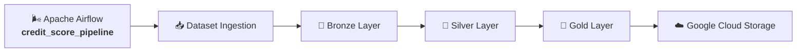

# 🌬️ Apache Airflow

Apache Airflow is responsible for orchestrating the end-to-end execution of the **Credit Score Data Platform**.

The workflow automates every stage of the Medallion Architecture, from downloading the dataset from Kaggle to publishing the Gold layer in **Google Cloud Storage**.

---

## 🏗️ Project Structure

```text
airflow/
├── dags/
│   └── credit_score_pipeline.py
├── tasks/
│   └── credit_score_tasks.py
└── README.md
```

### Components

| Component | Responsibility |
|-----------|----------------|
| `dags/` | Defines the Airflow DAG, scheduling, dependencies, retries, and workflow configuration. |
| `tasks/` | Contains task implementations that invoke the application pipeline. |
| `README.md` | Technical documentation for the orchestration layer. |

---

## 🔄 Workflow



The `credit_score_pipeline` DAG orchestrates the entire workflow, ensuring task dependency management, retries, monitoring, and reproducible executions.

---

## 📌 DAG Definition

The DAG is implemented in:

```text
dags/credit_score_pipeline.py
```

Its responsibilities include:

- Workflow definition
- Task dependencies
- Retry policy
- Execution timeout
- Scheduling configuration

The DAG contains orchestration logic only. Business rules remain isolated from the orchestration layer.

---

## ⚙️ Task Layer

Airflow tasks are implemented in:

```text
tasks/credit_score_tasks.py
```

Each task delegates execution to the application facade:

```text
src/pipeline/credit_score_pipeline.py
```

This design keeps Apache Airflow decoupled from the business logic, making the pipeline reusable by other orchestrators if needed.

---

## 🚀 Running Airflow Locally

### Activate the Airflow environment

```bash
source .venv-airflow/bin/activate
```

### Start Airflow

```bash
airflow standalone
```

### Trigger the pipeline

```bash
airflow dags trigger credit_score_pipeline
```

### Access the Web UI

```text
http://localhost:8080
```

---

## 📦 Runtime Environment

Airflow runtime files are stored in the project-level:

```text
.airflow/
```

This directory contains:

- Airflow metadata database
- Execution logs
- Generated configuration files
- Local authentication files

Runtime artifacts are generated automatically during execution and are excluded from version control through `.gitignore`.

---

## 📚 Related Documentation

For the complete project documentation, architecture diagrams, setup instructions, and implementation details, refer to the repository's main **README.md**.